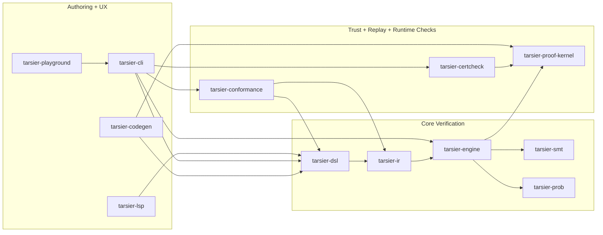

# Architecture

This document describes the high-level architecture of the Tarsier workspace and
how the 12 crates/components fit together in the verification pipeline.

## Workspace Components

| Component | Role |
|---|---|
| `tarsier-dsl` | Parser + AST for `.trs` protocol models |
| `tarsier-ir` | Lowering to threshold-automaton/counter-system IR |
| `tarsier-smt` | SMT encoding + solver backends (Z3/cvc5) |
| `tarsier-engine` | End-to-end verification pipeline orchestration |
| `tarsier-cli` | User-facing CLI commands and report generation |
| `tarsier-certcheck` | Standalone certificate replay checker binary |
| `tarsier-proof-kernel` | Minimal trusted certificate-integrity kernel |
| `tarsier-prob` | Hypergeometric committee analysis |
| `tarsier-codegen` | Rust/Go code generation from verified models |
| `tarsier-conformance` | Runtime trace conformance checking |
| `tarsier-lsp` | Language Server Protocol backend for `.trs` authoring |
| `tarsier-playground` | Local web UI over analysis/lint/visualization flows |

## 12-Crate Pipeline Diagram

## Runtime Flow (Analyze Path)

1. `tarsier-cli analyze` loads source text and invokes `tarsier-dsl` parse APIs.
2. `tarsier-ir` lowers AST to threshold-automaton IR.
3. `tarsier-engine` selects verification mode (bounded/unbounded/safety/liveness).
4. `tarsier-smt` builds constraints and calls solvers.
5. Optional `tarsier-prob` committee bounds are computed and injected.
6. Results, traces, and (governance mode) certificates are emitted.
7. Certificate integrity is validated by `tarsier-proof-kernel` and replayed via `tarsier-certcheck`.

## Trust Boundary Summary

- Trusted core: `tarsier-proof-kernel` (minimal verifier + certificate integrity checks).
- Untrusted but auditable orchestration: `tarsier-engine`, `tarsier-cli`, solver integrations.
- Independent replay path: `tarsier-certcheck` revalidates emitted artifacts.

For formal trust assumptions, see `docs/TRUST_BOUNDARY.md`.
